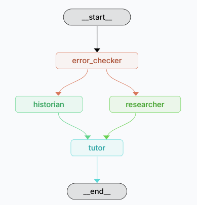

# Russian Language Tutor
This multi-model RAG agent serves as a personal Russian language tutor checking my mistakes on my writing. This agent provides a comprehensive guide going over my mistake, providing helpful online resources, and going into more detail on topics I particularly struggle with.

It utilizes 2 helper agents to get the job done. First is the Historian, a context driven RAG agent which utilizes embedding data stored in ChromaDB derived from my past Russian assginments and essays. This agent knows what I historically struggle with and can point out trend/ recognize what I need more explanation on. The second is the Researcher, an agent equiped to search the web. This one provides useful resources that can further my studies. The

## Model Architecture
The model architecture can be visualized as follows:



The diagram showcase how first a model is used to retrieve the mistakes found in the inputed student paper. Then this is passed both the Historian agent and the Researcher agent. Both of these models are called by the main agent to create a comprehensive study guide, again with access to the error analyst report output for complete context.

## Files
The primary code for this project and current place to run, with API keys accessible, is `tutor.ipynb`. The general organization of folders and project scripts, following set up, can be found below:

```
languagetutor/
├── .ipynb_checkpoints/                    
├── .venv/                                 
├── chroma/                         
  └── *context embeddings*
├── data/                 
  └── *pdfs of past work to convert to embeddings*                        
├── tutor.ipynb
├── pyproject.toml 
├── example.env
├── .gitignore
├── requirements.txt                           
└── README.md           
```
## References

- [LangGraph GitHub](https://github.com/langchain-ai/langgraph)
- [LangChain Documentation](https://python.langchain.com/docs/introduction/)
- [Implementing RAG in LangChain with Chroma - Callum Macpherson](https://medium.com/@callumjmac/implementing-rag-in-langchain-with-chroma-a-step-by-step-guide-16fc21815339)